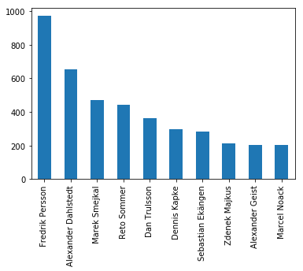
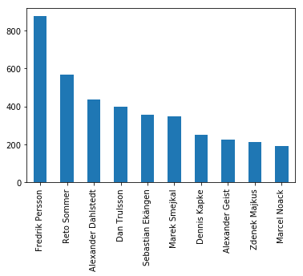
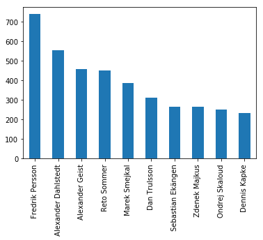
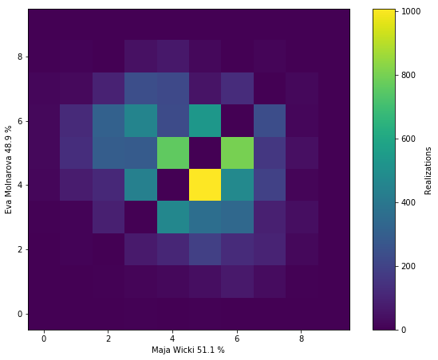
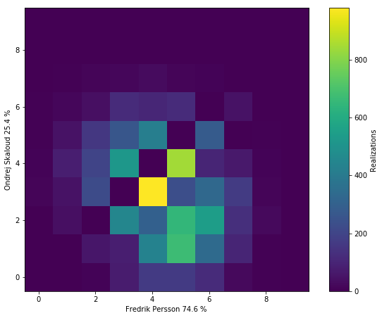
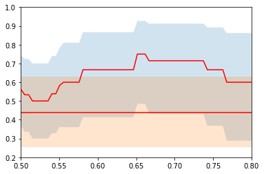
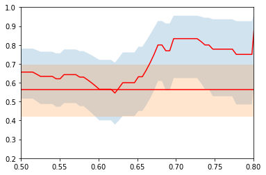
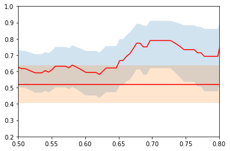

# WMC_2017_CUP
MC simulation of the matchplay

# Monte carlo simulations of the cup finals
Axel Ekman
## Introduction
Since the emergence of the CUP system I have always been fascinated by the fact that it produces a totally aspect to the game. Last time I did one of these checks, I did not have the tools nor the knowledge to do any of this properly so it turned out to be a whimsical mess of manually extracting data from the results to calculate some key values of which I could make some posteriori analysis of what it meant to be fair in the sense of lane choosing. 

Nowdays, whith common tools awailable, scraping the BAMSE server for results is more or less a trivial task, meaning that I could finally properly play around with the endless pit of number crunching. Alas, I do have a day job, so there is a limit of both time and effort I could put into this project. Nevertheless, let's see if we can dig up something interesting!

### Monte carlo simulations
The idea behind this project was to do a Monte Carlo simulation on the CUP finalsm using the acquired data from the preliminary rounds as pools for random sampling. For those note familiar, [Monte Carlo](https://en.wikipedia.org/wiki/Monte_Carlo_method) is just a fancy term for the usage of random sampling in computational problems. That is, for problems to complex for a analytical solution, it is often more simple to get a numerical solution using random sampling. For example, instead of carefully  measuring a die for perfect geometrical symmetry and balance, you can just throw it a 1000 times to see if it is biased.

## A priori predictions

As  *a priori*, the best we can do is to predict how players should perform in the cup. For this we generate a large number of realizations of these random Cups.

See [Methology](#methology) for details

We can explore e.g. the frequency of the winners of both cups


Another Interesting option is to explore the medal positions. here are tho most common medal permutations for the women:

```python
Counter(medals_w).most_common(10)
```
```Python
    [(('Melanie Hammerschmidt', 'Karin Olsson', 'Jasmin Ehm'), 44),
     (('Karin Olsson', 'Melanie Hammerschmidt', 'Jasmin Ehm'), 44),
     (('Melanie Hammerschmidt', 'Jasmin Ehm', 'Karin Olsson'), 42),
     (('Karin Olsson', 'Melanie Hammerschmidt', 'Vanessa Peuker'), 38),
     (('Melanie Hammerschmidt', 'Karin Olsson', 'Vanessa Peuker'), 32)]
```

And men

```python
Counter(medals_m).most_common(10)
```

```python
    [(('Fredrik Persson', 'Sebastian Ekängen', 'Alexander Dahlstedt'), 11),
     (('Reto Sommer', 'Fredrik Persson', 'Alexander Dahlstedt'), 11),
     (('Dan Trulsson', 'Fredrik Persson', 'Alexander Dahlstedt'), 7),
     (('Fredrik Persson', 'Marek Smejkal', 'Dan Trulsson'), 7),
     (('Fredrik Persson', 'Marek Smejkal', 'Alexander Dahlstedt'), 6),
     (('Fredrik Persson', 'Dan Trulsson', 'Ivan Macho'), 6),
     (('Fredrik Persson', 'Ivan Macho', 'Alexander Dahlstedt'), 5),
     (('Alexander Dahlstedt', 'Dan Trulsson', 'Fredrik Persson'), 5),
     (('Fredrik Persson', 'Dan Trulsson', 'Ondrej Skaloud'), 5),
     (('Fredrik Persson', 'Reto Sommer', 'Dan Trulsson'), 5)]
```

### Question : Is the seed relevant?
To answere this, we can randomly shuffle the input ranks of the players and rerun the simulation. 

 



Apart for the seeming dominance of Fredrik Persson in all permutations, the rest of the spots seem totally up for grabs, as we change the seeding of the table.

### Question: What can we say about individual matches
We can ofcourse also generate copious amounts of realizations for single matches. Tallying up the scores, this gives us predictions of the outcome of the score for each match. From this data we can generate a heat-map of all the observed scores, where the colour represents the frequency of the outcome.

As an example, let us look at the finals of both Cups:
```python
n_iter = 10000
plotGame('Eva Molnarova','Maja Wicki','E1',n_iter)
plotGame('Ondrej Skaloud','Fredrik Persson','E1',n_iter)
```




## A posteriori analysis of the cup results
So is the model usable? 
As a check of this, we can compare the predictions that the MC simulations does with other methods.

So here we have all the matches for both men and women, including player1, player2, winner and starting lane.

```python
matches_w = []
matches_w.append(Result('Melanie Hammerschmidt', 'Yana Lazareva','Melanie Hammerschmidt','F4'))
matches_w.append(Result('Nicole Birkelbach','Alena Dolezelova','Nicole Birkelbach','F7'))
matches_w.append(Result('Vanessa Peuker','Rebecca Weber','Rebecca Weber','F8'))
matches_w.append(Result('Eva Molnarova','Jasmin Hansson','Eva Molnarova','F12'))
matches_w.append(Result('Lara Jehle','Maja Wicki','Maja Wicki','F13'))
matches_w.append(Result('Jasmin Ehm','Katerina Tietzova','Jasmin Ehm','F15'))
matches_w.append(Result('Marielle Svensson','Yvonne Trachsel','Marielle Svensson','F17'))
matches_w.append(Result('Karin Olsson','Laura Fogh Henriksen','Karin Olsson','F18'))
matches_w.append(Result('Melanie Hammerschmidt','Nicole Birkelbach','Melanie Hammerschmidt','F2'))
matches_w.append(Result('Rebecca Weber','Eva Molnarova','Eva Molnarova','F7'))
matches_w.append(Result('Maja Wicki','Jasmin Ehm','Maja Wicki','F12'))
matches_w.append(Result('Marielle Svensson','Karin Olsson','Karin Olsson','F15'))
matches_w.append(Result('Melanie Hammerschmidt','Eva Molnarova','Eva Molnarova','E1'))
matches_w.append(Result('Maja Wicki','Karin Olsson','Maja Wicki','E1'))
matches_w.append(Result('Eva Molnarova','Maja Wicki','Eva Molnarova','E1'))
matches_w.append(Result('Melanie Hammerschmidt','Karin Olsson','Melanie Hammerschmidt','E1'))

matches_m = []
matches_m.append(Result('Reto Sommer','Sebastian Piekorz','Reto Sommer','F4'))
matches_m.append(Result('Marek Smejkal','Karel Molnar','Karel Molnar','F7'))
matches_m.append(Result('Ondrej Skaloud','Aki Sillman','Ondrej Skaloud','F8'))
matches_m.append(Result('Ivan Macho','Raphael Wietlisbach','Raphael Wietlisbach','F12'))
matches_m.append(Result('Walter Erlbruch','Georgy Lazarev','Walter Erlbruch','F13'))
matches_m.append(Result('Marian Strasko','Dan Trulsson','Dan Trulsson','F15'))
matches_m.append(Result('Sebastian Ekängen','Sebastian Heine','Sebastian Ekängen','F17'))
matches_m.append(Result('Dennis Kapke','Jan Anderegg','Jan Anderegg','F18'))
matches_m.append(Result('Marcel Noack','Youri Bottenberg','Marcel Noack','E1'))
matches_m.append(Result('Fredrik Persson','Sascha Spreier','Fredrik Persson','E3'))
matches_m.append(Result('Andreas Cederholm','Daniel Moser','Andreas Cederholm','E4'))
matches_m.append(Result('Zdenek Majkus','Ulf Kristiansson','Ulf Kristiansson','E5'))
matches_m.append(Result('Christian Gobetz','Fabian Spies','Christian Gobetz','E12'))
matches_m.append(Result('Igor Pantelimonov','Rupert Westenthaler','Rupert Westenthaler','E13'))
matches_m.append(Result('Alexander Geist','Martin Jecny','Martin Jecny','E14'))
matches_m.append(Result('Alexander Dahlstedt','Filip Johansson','Alexander Dahlstedt','E16'))
matches_m.append(Result('Reto Sommer','Karel Molnar','Karel Molnar','E1'))
matches_m.append(Result('Ondrej Skaloud','Raphael Wietlisbach','Ondrej Skaloud','E3'))
matches_m.append(Result('Walter Erlbruch','Dan Trulsson','Walter Erlbruch','E4'))
matches_m.append(Result('Sebastian Ekängen','Jan Anderegg','Sebastian Ekängen','E5'))
matches_m.append(Result('Marcel Noack','Fredrik Persson','Fredrik Persson','E12'))
matches_m.append(Result('Andreas Cederholm','Ulf Kristiansson','Andreas Cederholm','E13'))
matches_m.append(Result('Christian Gobetz','Rupert Westenthaler','Christian Gobetz','E14'))
matches_m.append(Result('Martin Jecny','Alexander Dahlstedt','Martin Jecny','E16'))
matches_m.append(Result('Karel Molnar','Ondrej Skaloud','Ondrej Skaloud','E1'))
matches_m.append(Result('Walter Erlbruch','Sebastian Ekängen','Walter Erlbruch','E4'))
matches_m.append(Result('Fredrik Persson','Andreas Cederholm','Fredrik Persson','E12'))
matches_m.append(Result('Christian Gobetz','Martin Jecny','Christian Gobetz','E14'))
matches_m.append(Result('Ondrej Skaloud','Walter Erlbruch','Ondrej Skaloud','E1'))
matches_m.append(Result('Fredrik Persson','Christian Gobetz','Fredrik Persson','E1'))
matches_m.append(Result('Ondrej Skaloud','Fredrik Persson','Fredrik Persson','E1'))
matches_m.append(Result('Walter Erlbruch','Christian Gobetz','Walter Erlbruch','E1'))
```

There are a couple of obvious deterministic approaches to predict mtches. One is obviously by the seeding rank of the player. The other by comparing the mean of the played lane. Running theese on both the cups yields the following:

Results, women:

    Rank prediction: 11/16
    Mean prediction: 7/16
    Random Sampling prediction: 9/16

Results, men:

    Rank prediction: 18/32
    Mean prediction: 18/32
    Random Sampling prediction: 21/32

Well, the results are not stellar. One could say that we systematically (5/6) at leat perform better than a counflip, but one cannot say, at without a statistics degree, whether this could just be normal variation.

### Question: A more meaningful predictor
The sampling population of this numerical fiddling is horrible, indeed. Another problem is, that for the coinflip cases (the mathces when the result is predicted to be nearly 50/50), there is no reason why the MC prediction shoukd be statistically meaningful as the game involves mnay hidden variables not taking into account.

The question now arises, is there a subset of games, for which the predictions are more accurate?

To check this, we can collect all the predictions for which the MC simulations gives a probability over a certain threshold, and plot the success of the prediction in these cases.

N.B, the number of samples is still quite small, so I have included somewhat 'generous' .9 [confidance bounds](https://en.wikipedia.org/wiki/Binomial_proportion_confidence_interval) for illustrational purposes. Here the two red lines represent the success rate of the predictions (the straing line using simply the mean of the lane results) with their confidancde bounds in blue and orange respectively.

```python
plotthconf(matches_w)
plotthconf(matches_m)
plotthconf(matches_w+matches_m)
```





## Methology 
### Game
In the Case of the simulation of the CUP final I implemented a random game, which randomly samples results for the players from past results (stroke play). Given a list of lanes, a starting lane and two plauyers, the game proceeds to give a random possible outcome of any match (including SD if tied after 18 lanes etc.).

### Cup
The cup is implemented as a series of Games. The first games are seeded by a prespecified rank, and the latter rounds are, as usual, seeded by the winners of the preliminary games.

Here is pseudocode for the womens cup for reference
```python
class Cup_16:
    def __init__(self,rank):
        self.games = dict()
        self.games['G1'] = Game(rank[1],rank[16],'F4')
        self.games['G2'] = Game(rank[8],rank[9],'F7')
        self.games['G3'] = Game(rank[5],rank[12],'F8')
        self.games['G4'] = Game(rank[4],rank[13],'F12')
        self.games['G5'] = Game(rank[3],rank[14],'F13')
        self.games['G6'] = Game(rank[6],rank[11],'F15')
        self.games['G7'] = Game(rank[7],rank[10],'F17')
        self.games['G8'] = Game(rank[2],rank[15],'F18')
        #bo8
        self.games['G9'] = Game(self.games['G1'].winner ,
                                self.games['G2'].winner,'F2')
        self.games['G10'] = Game(self.games['G3'].winner ,
                                 self.games['G4'].winner,'F7')
        self.games['G11'] = Game(self.games['G5'].winner ,
                                 self.games['G6'].winner,'F12')
        self.games['G12'] = Game(self.games['G7'].winner ,
                                 self.games['G8'].winner,'F15')
        #bo4
        self.games['S1'] = Game(self.games['G9'].winner ,
                                self.games['G10'].winner,'E1')
        self.games['S2'] = Game(self.games['G11'].winner ,
                                self.games['G12'].winner,'E1')
        #bronze
        self.games['Bronze'] = Game(self.games['S1'].loser ,
                                    self.games['S2'].loser,'E1')
        #bronze
        self.games['Final'] = Game(self.games['S1'].winner ,
                                    self.games['S2'].winner,'E1')

```
The larger cup can be implemented in a simlar fashion, albeit wiht a bit more typing.

