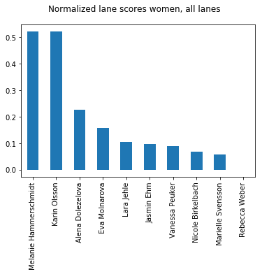
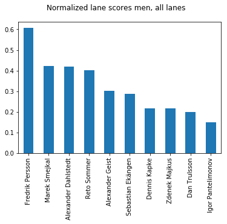

# WMC_2017_CUP
MC simulation of the matchplay

# Monte carlo simulations of the cup finals
Axel Ekman
## Introduction
Since the emergence of the CUP system I have always been fascinated by the fact that it produces a totally aspect to the game. Last time I did one of these checks, I did not have the tools nor the knowledge to do any of this properly so it turned out to be a whimsical mess of manually extracting data from the results to calculate some key values of which I could make some posterior analysis of what it meant to be fair in the sense of lane choosing. 

Nowadays, with common tools available, scraping the BAMSE server for results is more or less a trivial task, meaning that I could finally properly play around with the endless pit of number crunching. Alas, I do have a day job, so there is a limit of both time and effort I could put into this project. Nevertheless, let's see if we can dig up something interesting!

### Monte carlo simulations
The idea behind this project was to do a Monte Carlo simulation on the CUP finals using the acquired data from the preliminary rounds as pools for random sampling. For those note familiar, [Monte Carlo](https://en.wikipedia.org/wiki/Monte_Carlo_method) is just a fancy term for the usage of random sampling in computational problems. That is, for problems to complex for a analytical solution, it is often more simple to get a numerical solution using random sampling. For example, instead of carefully  measuring a die for perfect geometrical symmetry and balance, you can just throw it a 1000 times to see if it is biased.

## A priori predictions
As  *a priori*, the best we can do is to predict how players should perform in the cup. For this we generate a large number of realizations of these random Cups.

See [Methology](#methology) for details

### Lane averages
The first thing we can check is how the cup system changes the expected outcome of the rankings. That is, as the matchplay is played counting lane wins, not averages, players with the same average score are not equally likely in the matchplay system. 

An easy way to illustrate this is to think of two players drawing from a population of the same average [2,2,2,2] and [1,1,1,5] respectively. Even if the average of both players are the same, player 2 will win 75% of the time in a matchplay setting. That is, in general, for players with the same average, the one with more variation has an advantage.

Here we show a [Normalized Lane Score](#normalized-lane-score) for the top10 in both the women's and men's category.




The second, more controversial check, is to see what the chosen lanes do to this advantage. 




So who are the winners and losers in this deal?


### Simulated cups
As a full simulations, we do a MC simulation of the actual matchplay finals, that is, we can pair up the players with their actual opponents starting in the right lane, and advance the winner to the next place in the bracket. In this way we get a collection of (I used 10000) possible outcomes of the matchplay finals.

We can explore e.g. the frequency of the winners of both cups


Another Interesting option is to explore the medal positions. here are tho most common medal permutations for the women:

```python
Counter(medals_w).most_common(10)
```
```Python
    [(('Melanie Hammerschmidt', 'Karin Olsson', 'Jasmin Ehm'), 44),
     (('Karin Olsson', 'Melanie Hammerschmidt', 'Jasmin Ehm'), 44),
     (('Melanie Hammerschmidt', 'Jasmin Ehm', 'Karin Olsson'), 42),
     (('Karin Olsson', 'Melanie Hammerschmidt', 'Vanessa Peuker'), 38),
     (('Melanie Hammerschmidt', 'Karin Olsson', 'Vanessa Peuker'), 32)]
```

And men

```python
Counter(medals_m).most_common(10)
```

```python
    [(('Fredrik Persson', 'Sebastian Ekängen', 'Alexander Dahlstedt'), 11),
     (('Reto Sommer', 'Fredrik Persson', 'Alexander Dahlstedt'), 11),
     (('Dan Trulsson', 'Fredrik Persson', 'Alexander Dahlstedt'), 7),
     (('Fredrik Persson', 'Marek Smejkal', 'Dan Trulsson'), 7),
     (('Fredrik Persson', 'Marek Smejkal', 'Alexander Dahlstedt'), 6),
     (('Fredrik Persson', 'Dan Trulsson', 'Ivan Macho'), 6),
     (('Fredrik Persson', 'Ivan Macho', 'Alexander Dahlstedt'), 5),
     (('Alexander Dahlstedt', 'Dan Trulsson', 'Fredrik Persson'), 5),
     (('Fredrik Persson', 'Dan Trulsson', 'Ondrej Skaloud'), 5),
     (('Fredrik Persson', 'Reto Sommer', 'Dan Trulsson'), 5)]
```
## A posterior analysis of the results
So how did we do?

The results are in teh book and the national hymns have been sung. It is easy to naively analyse the results by anecdotal evidence: The only 'correctly' predicted medal in the tournament was the Gold by Fredrik Persson. 1/6 does not seem stellar. We must however notice accept that the cup-system is inherently very volatile, and even though all matches contain 18 lanes, the results have historically been very rich in unexpected events. Additionally, there are many more factors than pure averages that go into each mach that is played. Things that a simple MC simulation cannot hope to predict.

As a more rigorous approach, we can compare the predictions that the MC simulations does with other methods. In order to do so we can check the outcome for all the matches for both men and women. This is done using the correct starting lane of the mach.

There are a couple of obvious approaches to predict matches. One is obviously by the seeding rank of the player, as it is the basis of the bracket structure in the first place. The other is by comparing the observed averages the played lane. Both of these methods do suffer from the variance bias described in  [Lane Averages](#lane-averages) bit nevertheless, running these on both the cups yields the following:

Results, women:

    Rank prediction: 11/16
    Mean prediction: 7/16
    Random Sampling prediction: 9/16

Results, men:

    Rank prediction: 18/32
    Mean prediction: 18/32
    Random Sampling prediction: 21/32

Well, the results are not stellar. One could say that we systematically (5/6) at least perform better than a coin flip, but it is nontrivial to say whether this could just be normal variation.

### A more meaningful predictor
The sampling population of this numerical fiddling is horrible, indeed. Another problem is, that for the coin flip cases (the matches when the result is predicted to be nearly 50/50), there is no reason why the MC prediction should be statistically meaningful as the game involves many hidden variables.

The question now arises, is there a subset of games, for which the predictions are more accurate?

To check this, we can collect all the predictions for which the MC simulations gives a probability over a certain threshold, and plot the success of the prediction in these cases.

N.B, the number of samples is still quite small, so I have included somewhat 'generous' .9 [confidence bounds](https://en.wikipedia.org/wiki/Binomial_proportion_confidence_interval) for illustrational purposes. Here the two red lines represent the success rate of the predictions (the straight line using simply the mean of the lane results) with their confidence bounds in blue and orange respectively.


## Appendix: Additional Remarks

### Question : Is the seed relevant?
To answer this, we can randomly shuffle the input ranks of the players and rerun the simulation. 

 


Apart for the seeming dominance of Fredrik Persson in all permutations, the rest of the spots seem totally up for grabs, as we change the seeding of the table.

### Question: What can we say about individual matches
We can of course also generate copious amounts of realizations for single matches. Tallying up the scores, this gives us predictions of the outcome of the score for each match. From this data we can generate a heat-map of all the observed scores, where the colour represents the frequency of the outcome.

As an example, let us look at the finals of both Cups:
```python
n_iter = 10000
plotGame('Eva Molnarova','Maja Wicki','E1',n_iter)
plotGame('Ondrej Skaloud','Fredrik Persson','E1',n_iter)
```


## Appendix: Methology 
### Game
In the Case of the simulation of the CUP final I implemented a random game, which randomly samples results for the players from past results (stroke play). Given a list of lanes, a starting lane and two players, the game proceeds to give a random possible outcome of any match (including SD if tied after 18 lanes etc.). 

Without some syntactic wrappers, the inner logic is described by the following two methods:
```python
def match(player1,player2,lanes, lane):
    lane_index = lanes.index(lane)
    num_lanes = 0
    lanes_left = len(lanes)
    score = [0,0]
    while True:
        res = (getRandom(player1,lanes[lane_index]),
               getRandom(player2,lanes[lane_index])) 
        if res[0]<res[1]:
            score[0] = score[0] +1
        if res[1]<res[0]:
            score[1] = score[1] +1
        num_lanes = num_lanes+1
        lanes_left = lanes_left -1        
        
        if abs(score[1]-score[0])>lanes_left:
            return score
  
        lane_index = (lane_index+1)%len(lanes)
        if (lanes_left == 0):
            return sudden(player1,player2,lanes, lane_index,score)

def sudden(player1,player2,lanes, lane_index,score):
    while True:
        res = (getRandom(player1,lanes[lane_index]),
               getRandom(player2,lanes[lane_index])) 
        if res[0]<res[1]:
            score[0] = score[0] + 1
        if res[1]<res[0]:
            score[1] = score[1] + 1
        if res[0]!=res[1]:
            return score       
        
        lane_index = (lane_index+1)%len(lanes)
```

### Cup
The cup is implemented as a series of Games (which is just a class wrapper for the matches). The first games are seeded by a pre specified rank, and the latter rounds are, as usual, seeded by the winners of the preliminary games.

Here is pseudo code for the women's cup for reference
```python
class Cup_16:
    def __init__(self,rank):
        self.games = dict()
        self.games['G1'] = Game(rank[1],rank[16],'F4')
        self.games['G2'] = Game(rank[8],rank[9],'F7')
        self.games['G3'] = Game(rank[5],rank[12],'F8')
        self.games['G4'] = Game(rank[4],rank[13],'F12')
        self.games['G5'] = Game(rank[3],rank[14],'F13')
        self.games['G6'] = Game(rank[6],rank[11],'F15')
        self.games['G7'] = Game(rank[7],rank[10],'F17')
        self.games['G8'] = Game(rank[2],rank[15],'F18')
        #bo8
        self.games['G9'] = Game(self.games['G1'].winner ,
                                self.games['G2'].winner,'F2')
        self.games['G10'] = Game(self.games['G3'].winner ,
                                 self.games['G4'].winner,'F7')
        self.games['G11'] = Game(self.games['G5'].winner ,
                                 self.games['G6'].winner,'F12')
        self.games['G12'] = Game(self.games['G7'].winner ,
                                 self.games['G8'].winner,'F15')
        #bo4
        self.games['S1'] = Game(self.games['G9'].winner ,
                                self.games['G10'].winner,'E1')
        self.games['S2'] = Game(self.games['G11'].winner ,
                                self.games['G12'].winner,'E1')
        #bronze
        self.games['Bronze'] = Game(self.games['S1'].loser ,
                                    self.games['S2'].loser,'E1')
        #bronze
        self.games['Final'] = Game(self.games['S1'].winner ,
                                    self.games['S2'].winner,'E1')

```
The larger cup can be implemented in a similar fashion, albeit with a bit more typing.

### Normalized Lane Score


