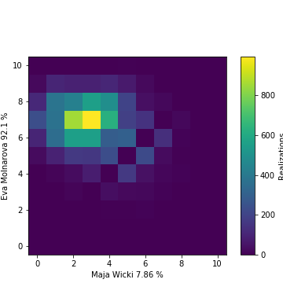
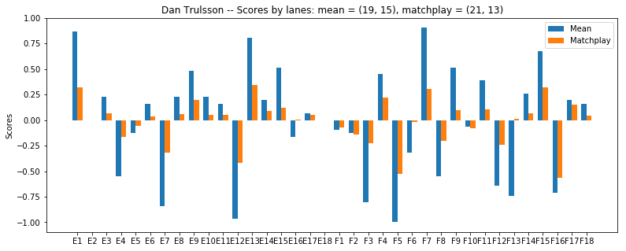
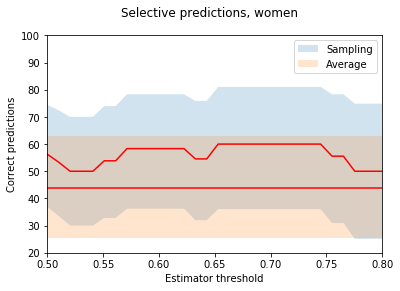
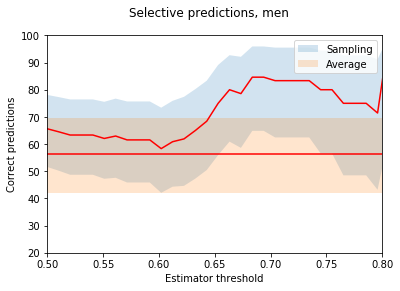
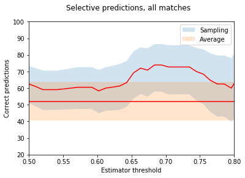

# WMC_2017_CUP
MC simulation of the match play finals.

# Monte carlo simulations of the cup finals
Axel Ekman
## Introduction
I have long wanted to do a numerical analysis on the match play system. 
Since the emergence of the CUP system I have always wondered how well the results correlate with the previous performance of the players. Last time I did one of these checks, I did not have the tools nor the knowledge to do any of this properly so it turned out to be a whimsical mess of manually extracting data from the results to calculate some key values of which I could make some estimate of who would be favoured in which match.

Nowadays, with common tools available, extracting data from [Bangolf Arena](http://www.isberginformation.com/eng/bangolfarena.htm) is more or less a trivial task, meaning that I could finally properly play around with the endless pit of number crunching. Alas, I do have a day job, so there is a limit of both time and effort I could put into this project. As a final disclaimer, I am not a CS major, nor a statistician and thus,it is most probable that the code is horrible, and the conclusions naive. Moreover, the amount of trials in the preliminary rounds is *way* to small, for any real statistical significance, thus many or all results should be taken with a grain of salt.

Nevertheless, let's see if we can dig up something interesting!

## Monte carlo simulations
The idea behind this project was that, as the [match play](http://www.psvsteyr.at/MINIGOLF/2017-09-22_WC2017_Matchplay/result.htm) championship is preceded by the [stroke play](http://www.psvsteyr.at/MINIGOLF/2017-09-15_WC2017Zaton-Croatia/result.htm) rounds, there is a substantial amount of data on the players' performance that could be used to try to predict outcomes in the match play finals. 

The obvious way to do this, is to do a Monte Carlo simulation on the CUP finals using the acquired data from the preliminary rounds as pools for random sampling. For those note familiar, [Monte Carlo](https://en.wikipedia.org/wiki/Monte_Carlo_method) is kind of an umbrella term for a wide range of numerical methods, which rely on random sampling. That is, it is often more simple to get a numerical solution using random sampling. For example, the easiest way to determine if a die is fair, is to throw it 1000 times and log the result.

### Single game
The same is true for the match play game. As each game depends on separate probabilities for each lane, an analytical attempt to determine the probabilities of players advancing in the bracket reveals itself to be a very tedious task. In the age of computers, it is much simper to instead simulate the cup. We can generate copious amounts of realizations for single matches and tallying up the scores, this gives us predictions of the outcome of the score for each match. 

As en example, for the finals of both Cups, here is the heat maps of all the observed scores, where the colour represents the frequency of the outcomes taken from 10000 realizations:




### Results of N random match play finals
Instead of repeating a single match *n* times, we can instead initialize the cup bracket and run the whole tournament *n* times. For the simulation of the match play, the players were placed in their respective positions in the bracket, and the matches were simulated by random sampling of all (including the stroke play finals) the observed results for each of the lanes (see [Methology](#methology) for details). The matches were simulated with the correct starting lanes, which is relevant in *e.g.* the case of sudden death.

In this way we get a collection of possible outcomes of the match play finals and can e.g. explore the frequency of the winners of both cups: 


At a glance, there is nothing special about the results, and the top favorites in both categories correlate quite well with their stroke play rank.

There are, however, some interesting deviations, such as Dan Trulsson, rising from number 21 to the top ten, and Marek Smejkal, as a dark horse on rank 3! And where has Eva Molnarova disappeared? All the way down to rank 9. This is because the predicted result of match play is fundamentally different than stroke play. The difference between lane averages vs. lane victories.

## Lane averages
As the scores are determined by lane victories only, there is a distinct difference in how lane results affect the predicted outcome in contrast to the stroke play. An easy way to illustrate this is to think what happens if the result of two players are [2,2,2,2] and [1,1,1,5] respectively. Even if the average of both players are the same, player 2 will win 75% of the time in a match play setting. That is, in general, for players with the same average, the one with more variation has an advantage. 

That is, as the match play is played counting lane wins, not averages, players with the same average score are not equally likely in the match play system.

So as an example, let us check two of the big movers in the cup system. Dan Trulsson and Walter Erlbruch.
I calculated the average lane score using both the mean result and random sampling to determine the lane result. This score shows the average result for the player over several matches. This was obtained against all other players in the cup finals ( with *n = 1000* for the random sampling). On the top I also show the match outcome calculated from these average results.




From Dans result we see, that even if he was in the bottom half of the bracket he is clearly favoured against the field both using the mean and the random sampling. This has to do with the relative variance of the scores.

Furthermore, the example described in the beginning even gets exactly reproduced, as the result for gentleman (F13) flips from a severe underdog, to a slight favorite with his [1,1,5,1] score.

As a counter example one would think that Walter (ranked 6th after stroke play) would be better of against the field. This is not the case, and applying a match play score against the field results in similar scores than for Dan. 


Things get even worse after half of the lanes are taken out, as they are all the wrong ones, after which he is dead even against the field.


The effect of this can also be investigated. So who are the winners and losers in this deal? Let us see:


## Bracket positioning
Another Interesting option is to explore the medal positions. here are the most common medal permutations for the women:

| Gold | Silver  | Bronze | Freq |
| --------------------- | -----| ----| --:|
| Melanie Hammerschmidt | Karin Olsson | Jasmin Ehm|575 |
| Karin Olsson | Melanie Hammerschmidt | Jasmin Ehm |  506 | 
| Melanie Hammerschmidt | Jasmin Ehm | Karin Olsson |  406 | 
| Melanie Hammerschmidt | Karin Olsson | Lara Jehle |  360 | 
| Karin Olsson | Melanie Hammerschmidt | Vanessa Peuker |  355|

An interesting observation is that even if Karin Olsson is the overwhelming favorite as the total winner, the most common outcome is that Melanie Hammersmidth wins over her in the final (if put against each other, Melanie wins with a rather tight marginal, 51-49 ). This has to mean that Melanie has some troublesome matchups along the way to the finals. I.e. there is antisymmetry in the bracket. So let's switch the original ranking of Karin and Melanie:

| Player                | Original Bracket  | Switched Bracket |
| --------------------- | -----:| ----:|
| Karin Olsson          | 4358  | 2936 |
| Melanie Hammerschmidt | 3029  | 4194 |
| Jasmin Ehm            |  830  |  897 |
| Vanessa Peuker        |  424  |  434 |
| Yana Lazareva         |  333  |  397 | 

Oh My! What a plot twist! The roles are completely reversed.

Another kind of bracket effect can be seen from the men:

| Gold | Silver  | Bronze | Freq |
| --------------------- | -----| ----| --:|
| Fredrik Persson | Reto Sommer | Alexander Dahlstedt |  57 | 
| Fredrik Persson | Dan Trulsson | Alexander Dahlstedt |  52 | 
| Fredrik Persson | Dennis Kapke | Alexander Dahlstedt |  50 | 
| Fredrik Persson | Sebastian Ekängen | Alexander Dahlstedt |  49|
| Alexander Dahlstedt | Marek Smejkal | Fredrik Persson |  48 | 
| Reto Sommer | Fredrik Persson | Alexander Dahlstedt |  47 | 
| Fredrik Persson | Ondrej Skaloud | Alexander Dahlstedt |  44 | 
| Fredrik Persson | Marek Smejkal | Dan Trulsson |  43 | 
| Fredrik Persson | Marek Smejkal | Alexander Dahlstedt |  43 | 
| Marek Smejkal | Fredrik Persson | Alexander Dahlstedt |  41|

A very prominent feature is the we se an abundance of the result (Persson, X, Dahlstedt). Here we see the effect of the bracket seeding. The world champion Alexander Dahlstedt was unfortunate to be placed in the lower bracket, that of the eminent favorite Persson, meaning that even if, overall, he is the second most likely winner, it seems that losing to Persson in the semifinals is even more likely.

## A posterior analysis of the results
The results are in the book, so how did we do?

It is easy to naively analyse the results by anecdotal evidence: The only 'correctly' predicted medal in the tournament was the Gold by Fredrik Persson. 1/6 does not seem stellar. We must however notice accept that the cup-system is inherently very volatile, and even though all matches contain 18 lanes, the results have historically been very rich in unexpected events. Additionally, there are many more factors than pure averages that go into each mach that is played. Things that a simple MC simulation cannot hope to predict.

As a more rigorous approach, we can compare the predictions that the MC simulations does with other methods. In order to do so we can check the outcome for all the matches for both men and women. This is done using the correct starting lane of the mach.

There are a couple of obvious approaches to predict matches. One is obviously by the seeding rank of the player, as it is the basis of the bracket structure in the first place. The other is by comparing the observed averages the played lane. Both of these methods do suffer from the variance bias described in the section [lane averages](#lane-averages). Nevertheless, running these on both the cups yields the following:

Results, women:

    Rank prediction: 11/16
    Mean prediction: 7/16
    Random Sampling prediction: 9/16

Results, men:

    Rank prediction: 18/32
    Mean prediction: 18/32
    Random Sampling prediction: 21/32

Well, the results are not stellar. One could say that we systematically (5/6) at least perform better than a coin flip, but it is nontrivial to say whether this could just be normal variation.

### A more meaningful predictor
The sampling population of this numerical fiddling is horrible, indeed. Another problem is, that for the coin flip cases (the matches when the result is predicted to be nearly 50/50), there is no reason why the MC prediction should be statistically meaningful as the game involves many hidden variables.

The question now arises, is there a subset of games, for which the predictions are more accurate?

To check this, we can collect all the predictions for which the MC simulations gives a probability over a certain threshold, and plot the success of the prediction in these cases. *I.e.* at a certain threshold, say 0.6, we ignore all the matches for which the MC simulation gives a probability less than 0.6. Simultaneously also the number of total observations meeting the criteria is lower. By normalizing the correct prediction with the total number of matches meeting the criterion we get a normalized accuracy for our method with respect to the probability threshold.





*N.B*, the number of samples is still quite small, so I have included somewhat 'generous' .9 [confidence bounds](https://en.wikipedia.org/wiki/Binomial_proportion_confidence_interval) for illustrative purposes. Here the two red lines represent the success rate of the predictions (the straight line using simply the mean of the lane results) with their confidence bounds in blue and orange respectively.

Well this looks somewhat meaningful. The results are systematically better than looking at the average, although, to be fair, for the women's matches it worked worse than a coin toss. When the sample size increases one can see somewhat a trend emerging, and indeed, in general there seems to be a slight correlation (with a correlation coefficient r = 0.57 for all thresholds with over 10 matches) between the confidence of the prediction and the result.

## Appendix: Methology

Short piece of pseudocode to clarify the MC simuialtion, check repo for details.

### Game
In the Case of the simulation of the CUP final I implemented a random game, which randomly samples results for the players from past results (stroke play). Given a list of lanes, a starting lane and two players, the game proceeds to give a random possible outcome of any match (including SD if tied after 18 lanes etc.). 

Without some syntactic wrappers, the inner logic is described by the following two methods:
```python
def match(player1,player2,lanes, lane):
    lane_index = lanes.index(lane)
    num_lanes = 0
    lanes_left = len(lanes)
    score = [0,0]
    while True:
        res = (getRandom(player1,lanes[lane_index]),
               getRandom(player2,lanes[lane_index])) 
        if res[0]<res[1]:
            score[0] = score[0] +1
        if res[1]<res[0]:
            score[1] = score[1] +1
        num_lanes = num_lanes+1
        lanes_left = lanes_left -1        
        
        if abs(score[1]-score[0])>lanes_left:
            return score
  
        lane_index = (lane_index+1)%len(lanes)
        if (lanes_left == 0):
            return sudden(player1,player2,lanes, lane_index,score)

def sudden(player1,player2,lanes, lane_index,score):
    while True:
        res = (getRandom(player1,lanes[lane_index]),
               getRandom(player2,lanes[lane_index])) 
        if res[0]<res[1]:
            score[0] = score[0] + 1
        if res[1]<res[0]:
            score[1] = score[1] + 1
        if res[0]!=res[1]:
            return score       
        
        lane_index = (lane_index+1)%len(lanes)
```

### Cup
The cup is implemented as a series of Games (which is just a class wrapper for the matches). The first games are seeded by a pre specified rank, and the latter rounds are, as usual, seeded by the winners of the preliminary games.

Here is pseudo code for the women's cup for reference
```python
class Cup_16:
    def __init__(self,rank):
        self.games = dict()
        self.games['G1'] = Game(rank[1],rank[16],'F4')
        self.games['G2'] = Game(rank[8],rank[9],'F7')
        self.games['G3'] = Game(rank[5],rank[12],'F8')
        self.games['G4'] = Game(rank[4],rank[13],'F12')
        self.games['G5'] = Game(rank[3],rank[14],'F13')
        self.games['G6'] = Game(rank[6],rank[11],'F15')
        self.games['G7'] = Game(rank[7],rank[10],'F17')
        self.games['G8'] = Game(rank[2],rank[15],'F18')
        #bo8
        self.games['G9'] = Game(self.games['G1'].winner ,
                                self.games['G2'].winner,'F2')
        self.games['G10'] = Game(self.games['G3'].winner ,
                                 self.games['G4'].winner,'F7')
        self.games['G11'] = Game(self.games['G5'].winner ,
                                 self.games['G6'].winner,'F12')
        self.games['G12'] = Game(self.games['G7'].winner ,
                                 self.games['G8'].winner,'F15')
        #bo4
        self.games['S1'] = Game(self.games['G9'].winner ,
                                self.games['G10'].winner,'E1')
        self.games['S2'] = Game(self.games['G11'].winner ,
                                self.games['G12'].winner,'E1')
        #bronze
        self.games['Bronze'] = Game(self.games['S1'].loser ,
                                    self.games['S2'].loser,'E1')
        #bronze
        self.games['Final'] = Game(self.games['S1'].winner ,
                                    self.games['S2'].winner,'E1')

```
The larger cup can be implemented in a similar fashion, albeit with a bit more typing.


